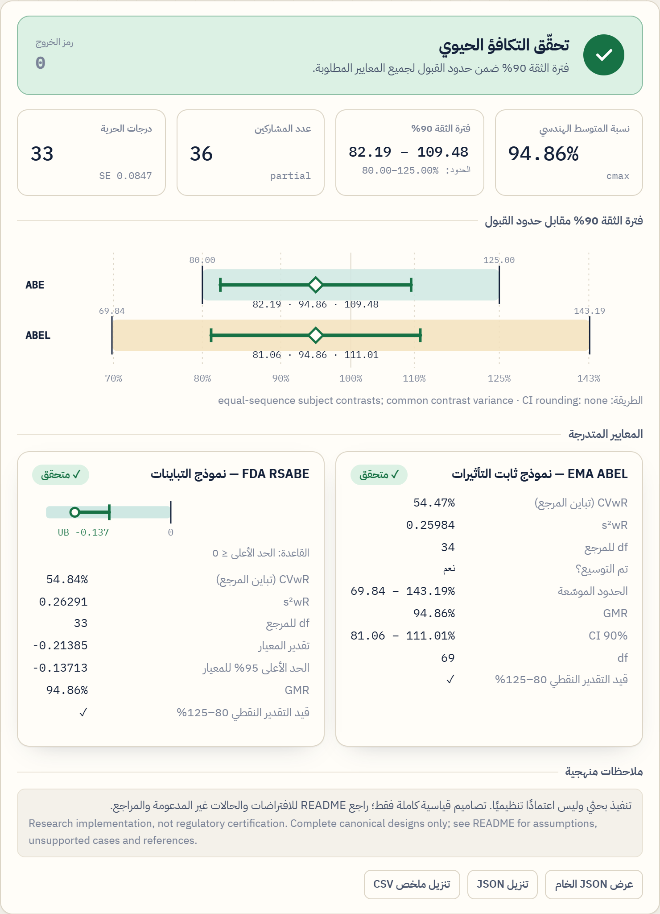
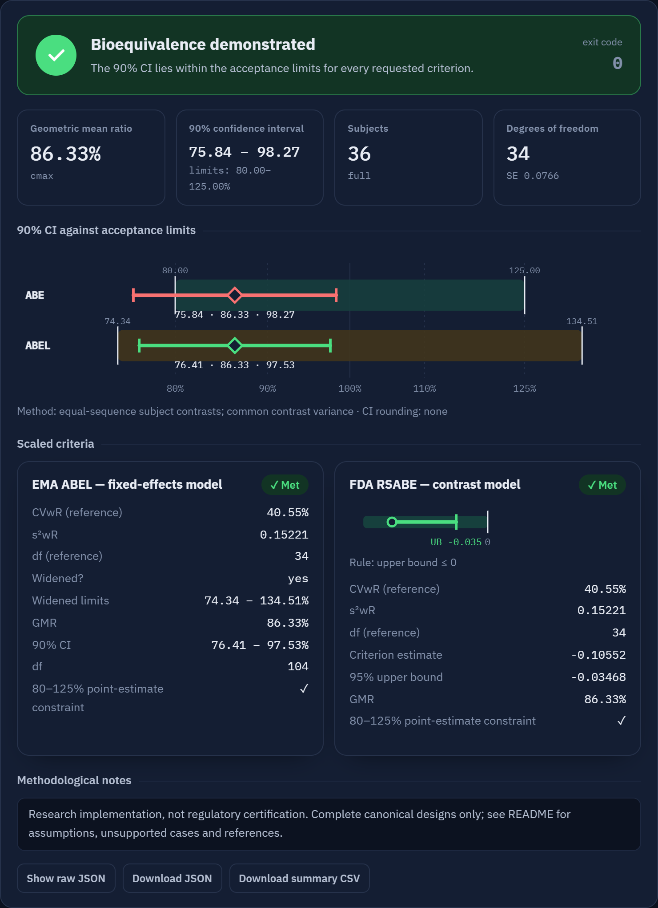
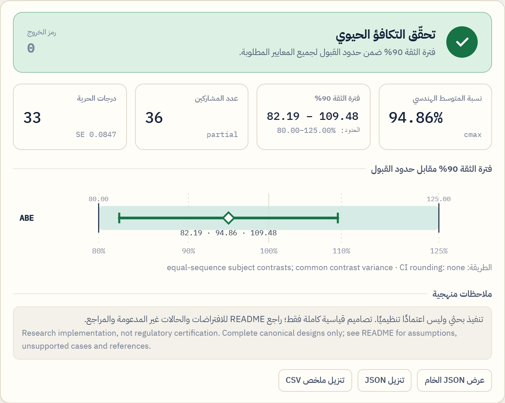
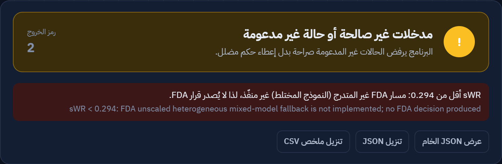
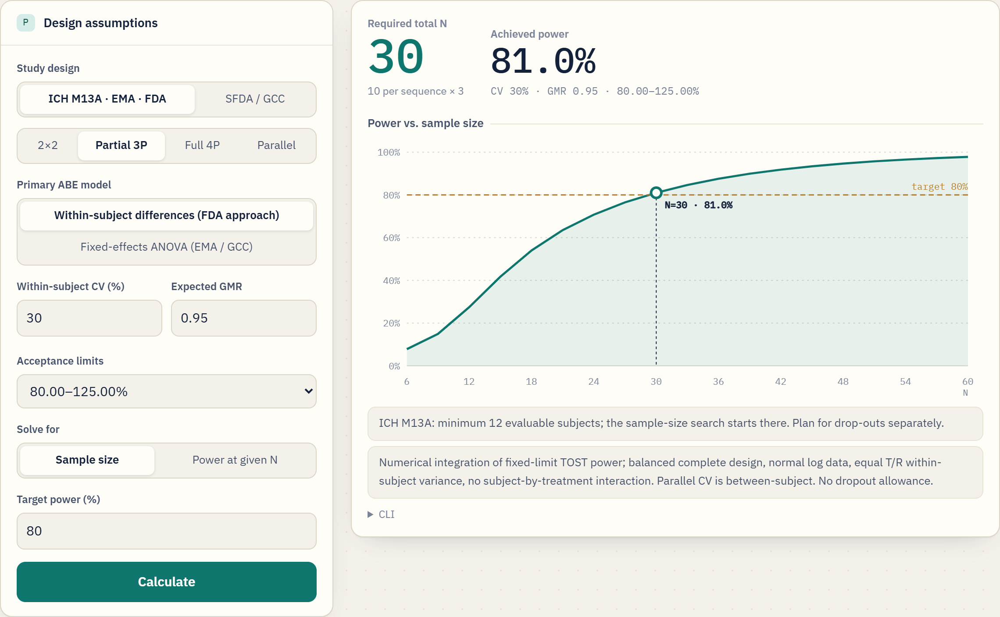
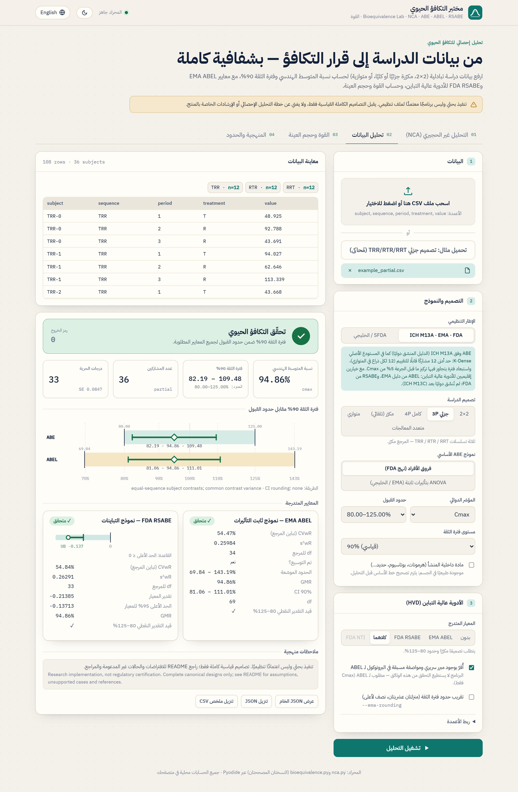
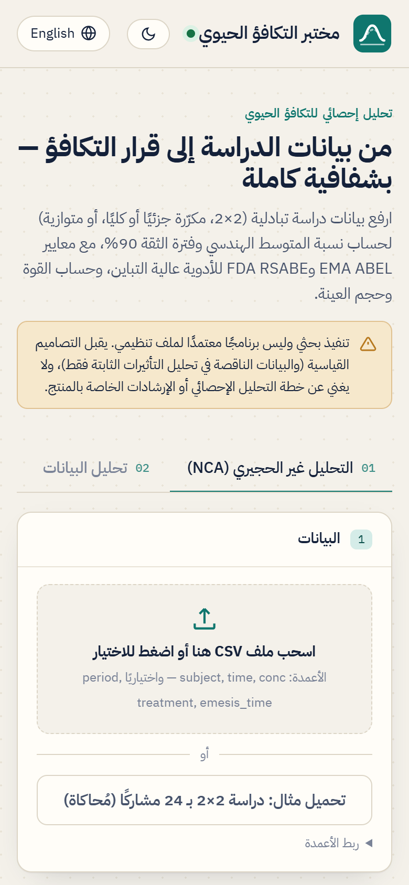
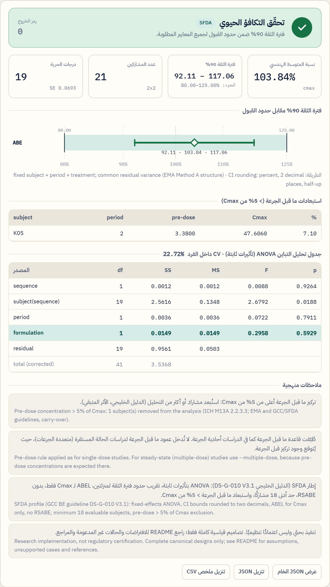

# Bioequivalence Lab · مختبر التكافؤ الحيوي

[](https://bioequivalence-lab.vercel.app)
[](LICENSE)


A bilingual (Arabic / English) web interface for average bioequivalence analysis — ABE, EMA ABEL, FDA RSABE, and power / sample size.
The page runs the Python engine (`engine/bioequivalence.py`) **in the browser** via [Pyodide](https://pyodide.org). No data leaves the user's device.

> ⚠️ **Research implementation, not regulatory certification.** Complete canonical designs only. It does not replace a statistical analysis plan or product-specific guidance. See [`engine/README.md`](engine/README.md) for model assumptions, unsupported cases and references.

**Live app:** https://bioequivalence-lab.vercel.app

## Regulatory comparison · مقارنة الأدلة التنظيمية

Reviewed against the full text of each document (September 2026). "—" = the document does not address the point; *not reviewed* = not checked in that document.

| Topic | ICH M13A (Step 4, Jul 2024) | EMA BE guideline Rev.1 | FDA *Statistical Approaches to Establishing BE* (May 2026) | GCC / SFDA DS-G-010 V3.1 (2022) | This app |
|---|---|---|---|---|---|
| **ABE criterion** | 90% CI of GMR within 80.00–125.00% (log scale) | same | same | same | ✓ both frameworks |
| **Rounding to 2 decimals** | not stated | ≥ 80.00 / ≤ 125.00 after rounding | rounded CI ≥ 80.00 and ≤ 125.00 | as EMA | ICH framework: optional · SFDA: always |
| **Model, crossover** | "appropriate parametric method, e.g. general linear model or mixed model" | ANOVA, **fixed** effects: sequence, subject(sequence), period, formulation | replicate designs: "mixed-effects or two-stage linear model" | as EMA (same wording) | *Within-subject differences (FDA)* = two-stage model; *Fixed-effects ANOVA (EMA / GCC)*; SFDA forces ANOVA |
| **ANOVA / effect tables in report** | required (sequence, subject(sequence), period, formulation) | required | *not reviewed* | required | `--anova`; always under SFDA |
| **Minimum evaluable subjects** | 12 (crossover); 12 per arm (parallel) | 12 | *not reviewed* | **18** (24 recommended) | SFDA: 18 · ICH framework: 12 (12 per arm, parallel); finding if fewer; power search starts there |
| **Pre-dose > 5% of Cmax** (single dose) | exclude that period | exclude | *not reviewed* | exclude | both frameworks (optional `predose` column); `--multiple-dose` / endogenous skip it |
| **Very low AUC (< 5% of GM)** | exceptional exclusion, **test or comparator** period | exceptional, **reference** only | *not reviewed* | as EMA (reference) | flagged, never excluded: T and R (ICH framework), R only (SFDA) |
| **Carry-over test** | not relevant | not relevant | *not reviewed* | not relevant | not performed |
| **Potency / assay-content correction** | batches within 5%; exceptional pre-specified correction, report **both** uncorrected and corrected | exceptional, pre-specified | *not reviewed* | as EMA | not implemented |
| **Endogenous substances** | pre-specified, period-specific baseline correction; negative concentrations set to 0; analyse **both** corrected and uncorrected, decide on corrected | baseline correction, subtractive method preferred | *not reviewed* | as EMA | `--endogenous`: subtraction of a baseline column, or explicit confirmation; parameter ≤ 0 → error |
| **Highly variable drugs** | out of scope (→ M13C) | **ABEL**: Cmax only, CVwR > 30%, k = 0.760, max 69.84–143.19%, GMR 80–125, replicate, pre-specified | **RSABE**: CVwR ≥ 30% (sWR ≥ 0.294), θ = (ln 1.25 / 0.25)², GMR 80–125, partial or full replicate | as EMA (ABEL only) | ABEL and RSABE (ICH framework); ABEL only (SFDA) |
| **Narrow therapeutic index** | out of scope (→ M13C) | 90.00–111.11% for AUC (and Cmax where important) | full replicate; RSABE with Δ = 1/0.9, σW0 = 0.10, **plus** ABE 80–125, **plus** σWT/σWR ≤ 2.5 | as EMA | fixed 90.00–111.11% only (EMA / GCC); FDA NTI method **not implemented** |
| **Two-stage / adaptive** | out of scope (→ M13C) | allowed; adjusted CI (e.g. 94.12%); stage term in ANOVA | adaptive designs allowed if fully pre-specified | as EMA | `--ci-level`; `stage` column adds stage terms |
| **Multiple comparators / tests** | analyse each comparison without the other arms | *not reviewed* | *not reviewed* | same as M13A | **not supported** (non-canonical sequences) |
| **Multi-group / multi-site** | model with group, sequence×group, subject(sequence×group), period(group); no group×treatment | *not reviewed* | *not reviewed* | — | not implemented (the two-stage `stage` term has the same structure) |
| **Missing data** | *not reviewed* | subjects without both T and R excluded | GLM (complete cases) or MIXED (all data), pre-specified | as EMA | complete, canonical data only |

**Why they differ.** ICH M13A (2024) harmonises only the basics of average BE for immediate-release oral products and explicitly defers highly variable drugs, NTI drugs and adaptive designs to M13C; until then each region keeps its own method. The GCC guideline V3.1 (2022) predates M13A and reproduces the EMA guideline almost word for word, adding stricter regional requirements (minimum 18 subjects, subject selection criteria). The FDA follows a different statistical tradition: mixed-effects or two-stage models for replicate designs and reference scaling (RSABE) for both highly variable and NTI drugs. We found no evidence that the SFDA has adopted M13A.

**Remaining gaps in this app:** the FDA NTI method (full replicate, reference scaling, σWT/σWR ≤ 2.5), multiple-comparator studies, multi-group models, potency correction and M13A's parallel analysis of baseline-uncorrected data for endogenous substances (possible manually with the confirmation option). The minimum-12 rule, the pre-dose rule and the test-product low-AUC flag of M13A were added to the ICH framework after this review.

Sources: [ICH M13A (FDA edition, Oct 2024)](https://www.fda.gov/media/165049/download) · [EMA CPMP/EWP/QWP/1401/98 Rev.1](https://www.ema.europa.eu/en/documents/scientific-guideline/guideline-investigation-bioequivalence-rev1_en.pdf) · [FDA Statistical Approaches to Establishing BE (May 2026)](https://www.fda.gov/media/163638/download) · [GCC DS-G-010 V3.1](https://www.sfda.gov.sa/sites/default/files/2022-08/GCC_Guidelines_Bioequivalence31_0.pdf)

<details>
<summary><b>الملخص بالعربية</b></summary>

- **متفق عليه في كل الأدلة:** فترة ثقة 90% للبيانات اللوغاريتمية ضمن 80.00–125.00%، ولا يُجرى اختبار للأثر المتبقي.
- **النموذج:** الدليل الأوروبي والخليجي يشترطان ANOVA بتأثيرات ثابتة؛ ICH M13A يقبل نموذجًا خطيًا عامًا أو مختلطًا؛ FDA يقبل للتصاميم المكرّرة نموذجًا مختلطًا أو نموذج «فروق الأفراد» على مرحلتين.
- **الحد الأدنى للمشاركين:** 12 في ICH M13A والأوروبي، و**18** في الخليجي.
- **الأدوية عالية التباين:** الأوروبي والخليجي يستخدمان ABEL لـ Cmax فقط؛ FDA يستخدم RSABE؛ ICH M13A أجّلها إلى M13C.
- **ضيقة المؤشر:** الأوروبي والخليجي يضيّقان الحدود إلى 90.00–111.11%؛ FDA يطلب تصميمًا مكرّرًا كاملًا مع معيار متدرج وحدود 80–125 ومقارنة تباين الاختبار بالمرجع (≤ 2.5).
- **المواد داخلية المنشأ:** الجميع يشترط تصحيح خط الأساس؛ ICH M13A يطلب التحليل بالقيم المصححة وغير المصححة معًا.
- **لماذا الاختلاف؟** ICH M13A وحّد الأساسيات فقط، والدليل الخليجي (2022) سبقه ونقل الدليل الأوروبي تقريبًا حرفيًا مع متطلبات أشد، وFDA له منهج إحصائي مختلف.
- **ما أُضيف بعد المقارنة:** إطار ICH يطبّق الآن الحد الأدنى 12 مشاركًا وقاعدة ما قبل الجرعة 5%، ويعرض المساحة المنخفضة للمستحضرين. **ما بقي ناقصًا:** طريقة FDA للأدوية ضيقة المؤشر، ودراسات أكثر من مرجع، ونماذج تعدد المجموعات، وتصحيح المحتوى.

</details>

## Screenshots

| Arabic interface — example study, all criteria met | Highly variable drug — EMA ABEL + FDA RSABE |
|---|---|
|  |  |
| **Same study without scaling — ABE not met (exit 1)** | **Unsupported case rejected explicitly (exit 2)** |
|  |  |

**Power & sample size** — partial replicate, CV 30%, GMR 0.95 → N = 30 (81.0%)



<details>
<summary>Full page and mobile views</summary>





</details>

All screenshots use simulated data from `engine/example_partial.csv`, `test_data/` and `test_cases/`.

## Features

- **Designs:** 2×2 (TR/RT), partial replicate (TRR/RTR/RRT), full replicate (TRTR/RTRT), auto-detected replicate, parallel.
- **Models:** equal-sequence subject contrasts (default) or EMA fixed effects (subject + period + treatment); Welch for parallel.
- **Limits:** 80.00–125.00%, NTI 90.00–111.11% (fixed limits only), or custom; optional half-up CI rounding.
- **Highly variable drugs:** EMA ABEL (Cmax, capped at CV 50%, point-estimate constraint) and FDA RSABE (Howe bound, sWR ≥ 0.294).
- **Power & sample size:** fixed-limit TOST power by numerical integration, with a power-vs-N curve.
- **Output:** verdict with exit code (0 pass · 1 not met · 2 invalid/unsupported), CI chart, scaled-criteria cards, JSON / CSV download.
- Arabic (RTL) and English UI, light and dark themes; engine messages are translated with the English original preserved.

## Regulatory frameworks

The UI offers two frameworks:

- **ICH M13A · EMA · FDA** (default) — the basis of the original [K-Dense `pkpd-modeling` skill](https://github.com/K-Dense-AI/scientific-agent-skills/tree/main/skills/pkpd-modeling) (`references/bioequivalence.md`): average BE on log data with the 90% CI inside 80.00–125.00% per the harmonised **ICH M13A** guideline (Step 4 July 2024, effective 25 January 2025), plus the two regional scaled criteria for highly variable drugs, which ICH has not yet harmonised (planned for M13C): **EMA ABEL** (EMA bioequivalence guideline, k = 0.760, capped at CVwR 50%) and **FDA RSABE** (Hyslop bound, θ = ln(1.25)/0.25, as in the FDA progesterone product-specific guidance). Sample sizes reproduce the published PowerTOST table.
- **SFDA / GCC** — see below.

## SFDA / GCC profile

Selecting **SFDA / GCC** in the UI (CLI: `--profile sfda`) applies the GCC bioequivalence guideline **DS-G-010 V3.1** (adopted by the SFDA), section by section:

| Guideline rule | What the profile does |
|---|---|
| ANOVA with fixed effects: sequence, subject within sequence, period, formulation | Forces the fixed-effects model; rejects `--analysis contrast` and Welch |
| CI bounds ≥ 80.00% and ≤ 125.00% **after rounding to two decimals** | Rounding always on |
| Widening (ABEL, k = 0.760, max 69.84–143.19%) for **Cmax only**; AUC stays 80.00–125.00% | ABEL allowed for Cmax only, with prospective justification |
| No reference-scaled (RSABE) approach | RSABE / "both" rejected |
| Minimum **18 evaluable subjects** | Fewer than 18 → finding, exit code 1; power solver starts at 18 |
| Pre-dose concentration **> 5% of Cmax** → exclude that subject-period (single-dose studies; not for endogenous substances) | Optional `predose` column; 2×2 / parallel: subject removed and listed; replicate: explicit error (incomplete design unsupported); `--endogenous` skips the rule. Do not supply it for steady-state studies |
| Reference AUC **< 5% of the reference geometric mean** may be excluded only in exceptional, pre-specified cases | Listed in a table (AUC metrics), never excluded automatically |
| Endogenous substances: parameters computed after pre-specified baseline correction; subtractive method preferred | `--endogenous` **requires** either a `baseline` column (mean pre-dose concentration, subtracted from Cmax; for AUC use a `baseline_auc` column or `--auc-hours`) or `--baseline-corrected` (explicit confirmation). Otherwise the analysis is refused. Values that become ≤ 0 are an explicit error. Before/after table in the output |
| Two-stage design: adjusted CI (e.g. 94.12%) and a term for stage in the ANOVA model | `--ci-level 94.12`; an optional `stage` column adds stage, sequence×stage, subject(sequence×stage) and period(stage) terms |
| ANOVA tables must be submitted | Full ANOVA table (SS, df, MS, F, p) and intra-subject CV in the output |



Not implemented: emesis-based exclusion (before 2 × median tmax for immediate release; apply it to the data beforehand as pre-specified); the check that AUC(0-t) covers ≥ 80% of AUC(0-∞) in at least 80% of observations; assay-content correction; dissolution similarity f2; product-specific guidance lookup. **Multiple-reference studies** (e.g. a three-period study with a GCC and a US reference) cannot be analysed yet: the guideline analyses each comparison after removing the other treatment's data, which leaves non-canonical sequences (such as T–R with periods 1 and 3) that this engine does not accept.

Sources re-checked against the full text of DS-G-010 V3.1 (sections 3.1.1–3.1.10): the widened-limit table (CVwR 30/35/40/45/≥50% → 80.00–125.00 / 77.23–129.48 / 74.62–134.02 / 72.15–138.59 / 69.84–143.19%) is reproduced exactly.

**Verification of the ANOVA:** estimate, 90% CI and formulation F-test match `statsmodels` OLS to ~1e-15 on balanced and unbalanced 2×2, partial and full replicate data; the subject(sequence) sum of squares matches the textbook between-subject formula and an explicit nested regression (statsmodels' Type I output is incorrect for this singular parameterisation). Tests: `engine/test_sfda.py` (13 tests) plus the original 12.

**Power note:** for a partial replicate with N = 24, CV 30%, GMR 0.95, power is 70.8% with the contrast model (df = N − 3) and 72.5% with the fixed-effects ANOVA model the SFDA profile uses (df = (N − 1)(P − 1) − 1). Both are correct for their model.

## Run

**Online:** deploy the repository root as a static site (Vercel, GitHub Pages, Cloudflare Pages). No build step is needed — `index.html` is self-contained.

**Locally (Windows):** double-click `run.bat`, or:

```bash
python -m http.server 8765
```

Then open http://localhost:8765. The first visit downloads Pyodide + NumPy + SciPy from jsDelivr (~20 MB, then cached).

## Data format

```csv
subject,sequence,period,treatment,value
S01,TR,1,T,933.70
S01,TR,2,R,1079.54
```

Column names are case-insensitive. `subject`, `treatment` and `value` can be remapped in the UI; `sequence` and `period` must use these names. Treatment labels `T`/`R`, `Test`/`Ref`/`Reference` are accepted. Values must be positive; the engine never silently drops, imputes or averages records.

Sample files: [`test_data/`](test_data) (two simulated studies) and [`test_cases/`](test_cases) (edge cases; files prefixed `ERR_` must be rejected). All data are simulated — no real clinical study.

## Repository layout

| Path | Contents |
|---|---|
| `index.html` | Built, self-contained app (deploy this) |
| `src/template.html`, `src/build.js` | UI source; `node src/build.js` regenerates `index.html` after editing the template or engine |
| `engine/` | Corrected Python engine, tests, simulation validation, provenance and the original upstream script |
| `test_data/`, `test_cases/` | Simulated CSV files for trying the app |

## Engine verification

```bash
cd engine
python -m pip install -r requirements.txt
python -m unittest -v
python validate_simulation.py
```

The web UI was checked against the engine's reference output (`engine/example_results.json`) and against an independent 2×2 computation (identical to 4 decimals).

---

## بالعربية

واجهة ويب ثنائية اللغة لتحليل التكافؤ الحيوي: ABE وEMA ABEL وFDA RSABE، وحساب القوة وحجم العينة. تشغّل الواجهة ملف `engine/bioequivalence.py` كما هو داخل المتصفح عبر Pyodide، ولا تُرسل البيانات إلى أي خادم.

> ⚠️ **تنفيذ بحثي وليس اعتمادًا تنظيميًا.** يقبل التصاميم الكاملة القياسية فقط، ولا يغني عن خطة التحليل الإحصائي أو الإرشادات الخاصة بالمنتج. راجع [`engine/اقرأني.md`](engine/اقرأني.md).

**الرابط المباشر:** https://bioequivalence-lab.vercel.app — لقطات الشاشة في الأعلى، وجميعها ببيانات مُحاكاة.

**إطار SFDA / الخليجي:** اختيار «SFDA / الخليجي» في الواجهة (أو `--profile sfda`) يطبّق دليل التكافؤ الحيوي الخليجي DS-G-010 V3.1: تحليل ANOVA بتأثيرات ثابتة، وتقريب حدود فترة الثقة لمنزلتين، وتوسيع الحدود (ABEL) لـ Cmax فقط، وعدم استخدام RSABE، وحد أدنى 18 مشاركًا قابلًا للتقييم، واستبعاد الفترة التي يتجاوز فيها تركيز ما قبل الجرعة 5% من Cmax (عمود `predose` اختياري)، وفترة ثقة معدّلة للتصميم على مرحلتين (مثل 94.12%) مع عمود `stage`، وإخراج جدول ANOVA كاملًا يتضمن حدّ المرحلة، وعرض (دون استبعاد) كل مرجع مساحته أقل من 5% من المتوسط الهندسي. قاعدة ما قبل الجرعة للدراسات أحادية الجرعة فقط. وللمواد داخلية المنشأ يطرح البرنامج خط الأساس (عمود `baseline`) أو يشترط تأكيدًا صريحًا بأن القيم مصححة، وإلا يرفض التحليل. غير منفّذ: استبعاد القيء، وفحص تغطية AUC(0-t) لـ 80%، وتصحيح المحتوى، ومعامل f2، وقاعدة بيانات الأدلة الخاصة بالمنتجات، ودراسات أكثر من مرجع (تحليلها يترك تسلسلات غير قياسية لا يقبلها المحرك).

**التشغيل:** انشر المجلد كموقع ثابت (Vercel أو GitHub Pages)، أو شغّل `run.bat` محليًا وافتح http://localhost:8765. أول زيارة تحمّل Python وNumPy وSciPy (نحو 20 ميغابايت).

**تنسيق البيانات:** الأعمدة `subject, sequence, period, treatment, value`. القيم موجبة، ولا حذف أو تعويض صامت للبيانات. ملفات للتجربة في `test_data` و`test_cases` (كلها بيانات مُحاكاة).

## License

MIT — see [LICENSE](LICENSE). The original engine is © 2025 K-Dense Inc. ([scientific-agent-skills](https://github.com/K-Dense-AI/scientific-agent-skills)), used under the MIT License.
