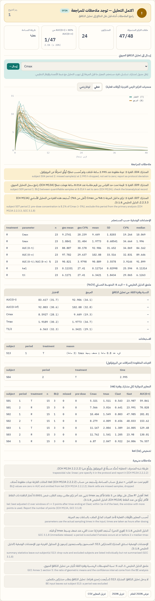
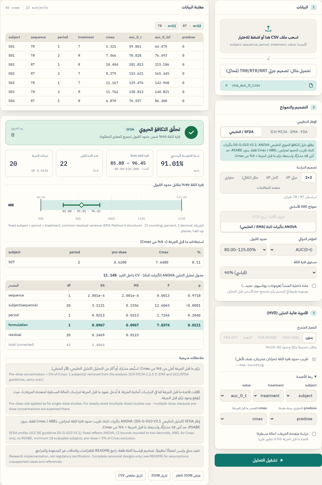

# Bioequivalence Lab · مختبر التكافؤ الحيوي

[](https://bioequivalence-lab.vercel.app)
[](LICENSE)


A bilingual (Arabic / English) web interface for bioequivalence studies — non-compartmental analysis (NCA) of concentration-time data, average BE (ABE, EMA ABEL, FDA RSABE), and power / sample size.
The page runs the Python engines (`engine/nca.py`, `engine/bioequivalence.py`) **in the browser** via [Pyodide](https://pyodide.org). No data leaves the user's device.

> ⚠️ **Research and teaching use only — provided “as is”, without warranty.** Not validated software for a regulatory submission: no computerised-system validation (GAMP 5), not tested on real study data, not compared with WinNonlin/Phoenix. Verify every result with validated software. See [Intended use and limitations](#intended-use-and-limitations) and [`engine/README.md`](engine/README.md).

**Version 1.0.0** · [Cite this software](#citation) · [Changes in 1.0.0](#changes-in-100-pre-launch-review)

**Live app:** https://bioequivalence-lab.vercel.app

## Regulatory comparison · مقارنة الأدلة التنظيمية

Reviewed against the full text of each document (September 2026). "—" = the document does not address the point; *not reviewed* = not checked in that document.

| Topic | ICH M13A (Step 4, Jul 2024) | EMA BE guideline Rev.1 | FDA *Statistical Approaches to Establishing BE* (May 2026) | GCC / SFDA DS-G-010 V3.1 (2022) | This app |
|---|---|---|---|---|---|
| **ABE criterion** | 90% CI of GMR within 80.00–125.00% (log scale) | same | same | same | ✓ both frameworks |
| **Rounding to 2 decimals** | not stated | ≥ 80.00 / ≤ 125.00 after rounding | rounded CI ≥ 80.00 and ≤ 125.00 | as EMA | ICH framework: optional · SFDA: always |
| **Model, crossover** | "appropriate parametric method, e.g. general linear model or mixed model" | ANOVA, **fixed** effects: sequence, subject(sequence), period, formulation | replicate designs: "mixed-effects or two-stage linear model" | as EMA (same wording) | *Within-subject differences (FDA)* = two-stage model; *Fixed-effects ANOVA (EMA / GCC)*; SFDA forces ANOVA |
| **ANOVA / effect tables in report** | required (sequence, subject(sequence), period, formulation) | required | *not reviewed* | required | `--anova`; always under SFDA |
| **Minimum evaluable subjects** | 12 (crossover); 12 per arm (parallel) | 12 | *not reviewed* | **18** (24 recommended) | SFDA: 18 · ICH framework: 12 (12 per arm, parallel); finding if fewer; power search starts there |
| **Pre-dose > 5% of Cmax** (single dose) | exclude that period | exclude | *not reviewed* | exclude | both frameworks (optional `predose` column); `--multiple-dose` / endogenous skip it |
| **Very low AUC (< 5% of GM)** | exceptional exclusion, **test or comparator** period | exceptional, **reference** only | *not reviewed* | as EMA (reference) | flagged, never excluded: T and R (ICH framework), R only (SFDA) |
| **Carry-over test** | not relevant | not relevant | *not reviewed* | not relevant | not performed |
| **Potency / assay-content correction** | batches within 5%; exceptional pre-specified correction, report **both** uncorrected and corrected | exceptional, pre-specified | *not reviewed* | as EMA | implemented: `--potency-test/--potency-reference` report the difference (finding if > 5 points); `--potency-correction` corrects only above 5 points and shows uncorrected and corrected analyses |
| **Endogenous substances** | pre-specified, period-specific baseline correction; negative concentrations set to 0; analyse **both** corrected and uncorrected, decide on corrected | baseline correction, subtractive method preferred | *not reviewed* | as EMA | `--endogenous`: subtraction of a baseline column, or explicit confirmation; parameter ≤ 0 → error |
| **Highly variable drugs** | out of scope (→ M13C) | **ABEL**: Cmax only, CVwR > 30%, k = 0.760, max 69.84–143.19%, GMR 80–125, replicate, pre-specified | **RSABE**: CVwR ≥ 30% (sWR ≥ 0.294), θ = (ln 1.25 / 0.25)², GMR 80–125, partial or full replicate | as EMA (ABEL only) | ABEL and RSABE (ICH framework); ABEL only (SFDA) |
| **Narrow therapeutic index** | out of scope (→ M13C) | 90.00–111.11% for AUC (and Cmax where important) | full replicate; RSABE with Δ = 1/0.9, σW0 = 0.10, **plus** ABE 80–125, **plus** σWT/σWR ≤ 2.5 | as EMA | fixed 90.00–111.11% (EMA / GCC, `--nti`); **FDA NTI method** `--scaling fda-nti` (full replicate; scaled bound, unscaled ABE and σWT/σWR ≤ 2.5; not under SFDA) |
| **Two-stage / adaptive** | out of scope (→ M13C) | allowed; adjusted CI (e.g. 94.12%); stage term in ANOVA | adaptive designs allowed if fully pre-specified | as EMA | `--ci-level`; `stage` column adds stage terms |
| **Multiple comparators / tests** | analyse each comparison without the other arms | *not reviewed* | *not reviewed* | same as M13A | `--design multi` with `--test-label` / `--reference-label`: one comparison per run, other treatment removed, original periods, fixed-effects ANOVA (e.g. Williams T / R-GCC / R-US) |
| **Multi-group / multi-site** | model with group, sequence, sequence×group, subject(sequence×group), period(group); no group×treatment | *not reviewed* | *not reviewed* | — | optional `group` column: group, sequence, sequence×group, subject(sequence×group), period(group), formulation; group×formulation reported as a supportive F-test |
| **Missing data** | primary analysis on subjects with evaluable data for both products (2.2.3.2); Q&A 2.9: in a 2-way crossover a subject with an excluded period leaves the analysis, in more complex designs not necessarily | subjects without both T and R excluded | GLM (complete cases) or MIXED (all data), pre-specified | as EMA | fixed-effects model (EMA Method A) and ABEL: all available observations of replicate subjects; 2×2 and multi-treatment comparisons leave out subjects without both products (listed); contrast model, RSABE and FDA NTI need complete subjects |

**Why they differ.** ICH M13A (2024) harmonises only the basics of average BE for immediate-release oral products and explicitly defers highly variable drugs, NTI drugs and adaptive designs to M13C; until then each region keeps its own method. The GCC guideline V3.1 (2022) predates M13A and reproduces the EMA guideline almost word for word, adding stricter regional requirements (minimum 18 subjects, subject selection criteria). The FDA follows a different statistical tradition: mixed-effects or two-stage models for replicate designs and reference scaling (RSABE) for both highly variable and NTI drugs. We found no evidence that the SFDA has adopted M13A.

**Remaining gaps in this app:** M13A's parallel analysis of baseline-uncorrected data for endogenous substances (possible manually with the confirmation option). Added after this review: potency correction; the minimum-12 rule, pre-dose rule and test-product low-AUC flag of M13A; the FDA NTI method; multiple-comparator studies; multi-group models.

Sources: [ICH M13A (FDA edition, Oct 2024)](https://www.fda.gov/media/165049/download) · [EMA CPMP/EWP/QWP/1401/98 Rev.1](https://www.ema.europa.eu/en/documents/scientific-guideline/guideline-investigation-bioequivalence-rev1_en.pdf) · [FDA Statistical Approaches to Establishing BE (May 2026)](https://www.fda.gov/media/163638/download) · [GCC DS-G-010 V3.1](https://www.sfda.gov.sa/sites/default/files/2022-08/GCC_Guidelines_Bioequivalence31_0.pdf)

<details>
<summary><b>الملخص بالعربية</b></summary>

- **متفق عليه في كل الأدلة:** فترة ثقة 90% للبيانات اللوغاريتمية ضمن 80.00–125.00%، ولا يُجرى اختبار للأثر المتبقي.
- **النموذج:** الدليل الأوروبي والخليجي يشترطان ANOVA بتأثيرات ثابتة؛ ICH M13A يقبل نموذجًا خطيًا عامًا أو مختلطًا؛ FDA يقبل للتصاميم المكرّرة نموذجًا مختلطًا أو نموذج «فروق الأفراد» على مرحلتين.
- **الحد الأدنى للمشاركين:** 12 في ICH M13A والأوروبي، و**18** في الخليجي.
- **الأدوية عالية التباين:** الأوروبي والخليجي يستخدمان ABEL لـ Cmax فقط؛ FDA يستخدم RSABE؛ ICH M13A أجّلها إلى M13C.
- **ضيقة المؤشر:** الأوروبي والخليجي يضيّقان الحدود إلى 90.00–111.11%؛ FDA يطلب تصميمًا مكرّرًا كاملًا مع معيار متدرج وحدود 80–125 ومقارنة تباين الاختبار بالمرجع (≤ 2.5).
- **المواد داخلية المنشأ:** الجميع يشترط تصحيح خط الأساس؛ ICH M13A يطلب التحليل بالقيم المصححة وغير المصححة معًا.
- **لماذا الاختلاف؟** ICH M13A وحّد الأساسيات فقط، والدليل الخليجي (2022) سبقه ونقل الدليل الأوروبي تقريبًا حرفيًا مع متطلبات أشد، وFDA له منهج إحصائي مختلف.
- **ما أُضيف بعد المقارنة:** الحد الأدنى 12 مشاركًا وقاعدة ما قبل الجرعة في إطار ICH، وطريقة FDA للأدوية ضيقة المؤشر، ودراسات أكثر من مرجع (مثل Williams بمرجع خليجي وأمريكي)، ونماذج تعدد المجموعات، وتصحيح المحتوى.

</details>

## Screenshots

All screenshots use simulated data and show the current version (regenerate with `node docs/capture_screenshots.mjs` while `python -m http.server 8766` serves the repository).

| NCA tab — simulated 2×2 study, SFDA profile | NCA parameters sent to the BE analysis (AUC(0-t)) |
|---|---|
|  |  |

| Arabic interface — example study, all criteria met | Highly variable drug — EMA ABEL + FDA RSABE |
|---|---|
|  |  |
| **Same study without scaling — ABE not met (exit 1)** | **Unsupported case rejected explicitly (exit 2)** |
|  |  |

**Power & sample size** — partial replicate, CV 30%, GMR 0.95 → N = 30 (81.0%)


<details>
<summary>Full page and mobile views</summary>


</details>

All screenshots use simulated data from `engine/example_partial.csv`, `test_data/` and `test_cases/`.

## Features

- **NCA (tab 01):** Cmax, tmax, AUC(0-t), AUC(0-∞), kel, t½, AUC(0-72h), partial AUCs, and steady-state AUC(0-τ), Cmax,ss, Cmin,ss, Cτ,ss, Cav,ss, fluctuation, swing; ICH M13A BLQ and 80/20 coverage rules, missed-sample deviations, pre-dose > 5% flag, baseline correction, GCC emesis rule and Annex 1 table; one click sends the parameters to the BE analysis. Details and sources: [`engine/README.md`](engine/README.md#nca-module-ncapy).
- **Designs:** 2×2 (TR/RT), partial replicate (TRR/RTR/RRT), full replicate (TRTR/RTRT), auto-detected replicate, parallel, and multi-treatment crossovers (e.g. Williams with two references), one comparison per run; optional `stage` (two-stage) and `group` (multi-group) columns.
- **Models:** equal-sequence subject contrasts (default) or EMA fixed effects (subject + period + treatment); Welch for parallel.
- **Limits:** 80.00–125.00%, NTI 90.00–111.11% (fixed limits only), or custom; optional half-up CI rounding.
- **Highly variable drugs:** EMA ABEL (Cmax, capped at CV 50%, point-estimate constraint) and FDA RSABE (Howe bound, sWR ≥ 0.294).
- **Narrow therapeutic index:** fixed 90.00–111.11% limits (EMA / GCC) or the FDA method (full replicate: reference-scaled bound with θ = (ln(1/0.9)/0.10)², unscaled ABE, and upper 90% limit of σWT/σWR ≤ 2.5).
- **Power & sample size:** fixed-limit TOST power by numerical integration, with a power-vs-N curve.
- **Output:** verdict with exit code (0 pass · 1 not met · 2 invalid/unsupported), CI chart, scaled-criteria cards, JSON / CSV download.
- Arabic (RTL) and English UI, light and dark themes; engine messages are translated with the English original preserved.

## Regulatory frameworks

The UI offers two frameworks:

- **ICH M13A · EMA · FDA** (default) — the basis of the original [K-Dense `pkpd-modeling` skill](https://github.com/K-Dense-AI/scientific-agent-skills/tree/main/skills/pkpd-modeling) (`references/bioequivalence.md`): average BE on log data with the 90% CI inside 80.00–125.00% per the harmonised **ICH M13A** guideline (Step 4 July 2024, effective 25 January 2025), plus the two regional scaled criteria for highly variable drugs, which ICH has not yet harmonised (planned for M13C): **EMA ABEL** (EMA bioequivalence guideline, k = 0.760, capped at CVwR 50%) and **FDA RSABE** (Howe’s approximation of the 95% upper bound, as in the FDA SAS code; θ = (ln 1.25 / 0.25)² ≈ 0.797, i.e. √θ = 0.893). Sample sizes reproduce the published PowerTOST table.
- **SFDA / GCC** — see below.

## SFDA / GCC profile

Selecting **SFDA / GCC** in the UI (CLI: `--profile sfda`) applies the SFDA **Guidelines for Bioequivalence, DS-G-010 V3.1** (10 August 2022; published on the SFDA site as the GCC guideline and cited here as “GCC” with its section numbers), section by section:

| Guideline rule | What the profile does |
|---|---|
| ANOVA with fixed effects: sequence, subject within sequence, period, formulation | Forces the fixed-effects model; rejects `--analysis contrast` and Welch |
| CI bounds ≥ 80.00% and ≤ 125.00% **after rounding to two decimals** | Rounding always on |
| Widening (ABEL, k = 0.760, max 69.84–143.19%) for **Cmax only**; AUC stays 80.00–125.00% | ABEL allowed for Cmax only, with prospective justification |
| No reference-scaled (RSABE) approach | RSABE / "both" rejected |
| Minimum **18 evaluable subjects** | Fewer than 18 → finding, exit code 1; power solver starts at 18 |
| Pre-dose concentration **> 5% of Cmax** → exclude that subject-period; in a 2-period trial the subject is removed; not for endogenous substances (3.1.8) | Applied to single-dose studies (as ICH M13A 2.2.3.3 states; `--multiple-dose` skips it). Optional `predose` column; 2×2 / parallel: subject removed and listed; replicate: only that period is removed and the fixed-effects model analyses the remaining data (with `--analysis contrast` an explicit error); `--endogenous` skips the rule. Do not supply it for steady-state studies |
| Reference AUC **< 5% of the reference geometric mean** may be excluded only in exceptional, pre-specified cases | Listed in a table (AUC metrics), never excluded automatically |
| Endogenous substances: parameters computed after pre-specified baseline correction; subtractive method preferred | `--endogenous` **requires** either a `baseline` column (mean pre-dose concentration, subtracted from Cmax; for AUC use a `baseline_auc` column or `--auc-hours`) or `--baseline-corrected` (explicit confirmation). Otherwise the analysis is refused. Values that become ≤ 0 are an explicit error. Before/after table in the output |
| Two-stage design: adjusted CI (e.g. 94.12%) and a term for stage in the ANOVA model | `--ci-level 94.12`; an optional `stage` column adds stage, sequence×stage, subject(sequence×stage) and period(stage) terms |
| ANOVA tables must be submitted | Full ANOVA table (SS, df, MS, F, p) and intra-subject CV in the output |


The emesis rule (at or before 2 × median tmax for immediate release) and the 80/20 AUC(0-t) coverage check are applied in the NCA tab (`engine/nca.py`). Multiple-reference studies are analysed one comparison at a time (design "multi"). Assay-content (potency) correction: see below. Not implemented: dissolution similarity f2; product-specific guidance lookup.

**Potency (assay-content) correction** — the test and reference batch potencies should not differ by more than 5% (ICH M13A 2.2.2.3; GCC 3.1.2); correction is exceptional and must be pre-specified (ICH M13A 2.2.2.3; GCC 3.1.8 and EMA 4.1.8, which also ask for the assay results of both batches in the protocol). Only ICH M13A 2.2.2.3 adds that the analysis is reported for both uncorrected and corrected data, BE is judged on the corrected data, and the correction may be justified with, e.g., assay data of several reference batches; the SFDA framework of this app follows M13A on these points. With the two assay results (% of label claim) the engine reports the difference, and a finding when it exceeds 5 percentage points. With `--potency-correction` (the user confirms pre-specification) and a difference above 5 points, each value is multiplied by 100 / the assayed content of its batch, the decision uses the corrected data, and the same criterion (fixed limits, ABEL, RSABE or FDA NTI) is also computed on the uncorrected data and shown alongside with the limits used; within 5 points nothing is corrected. The pre-dose rule uses the measured values. **Interpretations, not stated in the guidelines:** the difference is taken in percentage points of label claim, and the correction formula is the usual dose normalisation, which assumes exposure proportional to dose (linear pharmacokinetics). On the log scale it shifts the estimate by ln(potency R / potency T) and leaves the confidence-interval width and CVwR unchanged (tested in `engine/test_potency.py`).

Sources re-checked against the full text of DS-G-010 V3.1 (sections 3.1.1–3.1.10): the widened-limit table (CVwR 30/35/40/45/≥50% → 80.00–125.00 / 77.23–129.48 / 74.62–134.02 / 72.15–138.59 / 69.84–143.19%) is reproduced exactly.

**Verification of the ANOVA:** estimate, 90% CI and formulation F-test match `statsmodels` OLS to ~1e-15 on balanced and unbalanced 2×2, partial and full replicate data; the subject(sequence) sum of squares matches the textbook between-subject formula and an explicit nested regression (statsmodels' Type I output is incorrect for this singular parameterisation). Tests: `engine/test_sfda.py` (28 tests), `engine/test_extensions.py` (11) and the original 12.

**Power note:** for a partial replicate with N = 24, CV 30%, GMR 0.95, power is 70.8% with the contrast model (df = N − 3) and 72.5% with the fixed-effects ANOVA model the SFDA profile uses (df = (N − 1)(P − 1) − 1). Both are correct for their model.

## Run

**Online:** deploy the repository root as a static site (Vercel, GitHub Pages, Cloudflare Pages). No build step is needed — `index.html` is self-contained.

**Locally (Windows):** double-click `run.bat`, or:

```bash
python -m http.server 8765
```

Then open http://localhost:8765. The first visit downloads Pyodide + NumPy + SciPy from jsDelivr (~20 MB, then cached).

## Data format

```csv
subject,sequence,period,treatment,value
S01,TR,1,T,933.70
S01,TR,2,R,1079.54
```

Column names are case-insensitive. `subject`, `treatment` and `value` can be remapped in the UI; `sequence` and `period` must use these names. Treatment labels `T`/`R`, `Test`/`Ref`/`Reference` are accepted. Values must be positive; the engine never silently drops, imputes or averages records. In the fixed-effects analysis (`--analysis ema`, ABEL, SFDA profile) subjects with missing periods — absent rows, or a blank / `NA` value — are analysed with all their available observations and listed in the output; the contrast analysis, RSABE and the FDA NTI method require complete subjects.

Sample files: [`test_data/`](test_data) (seven simulated studies) and [`test_cases/`](test_cases) (edge cases; files prefixed `ERR_` must be rejected). All data are simulated — no real clinical study.

## Repository layout

| Path | Contents |
|---|---|
| `index.html` | Built, self-contained app (deploy this) |
| `src/template.html`, `src/build.js` | UI source; `node src/build.js` regenerates `index.html` after editing the template or engine |
| `engine/` | Corrected Python engines (`nca.py`, `bioequivalence.py`), tests, simulation validation, provenance and the original upstream scripts |
| `test_data/`, `test_cases/` | Simulated CSV files for trying the app |

## Engine verification

```bash
cd engine
python -m pip install -r requirements.txt
python -m unittest -v
python validate_simulation.py
```

`python -m unittest -v` runs 114 tests; `python -m unittest test_nca -v` runs the 37 NCA tests (independent scipy reference, closed-form profiles, guideline rules), and `test_launch_review.py` (16 tests) covers the NCA → BE hand-off across designs, subjects without both products, potency correction with scaled criteria, the ABEL point-estimate rounding and the findings of the independent second review. **Browser engine against local Python** (`engine/validation/browser_parity.mjs`): 20 command lines (5 NCA runs including the 348 single-dose and 60 steady-state validation profiles, 15 BE runs covering every design, framework, scaled criterion, potency correction and power) run through the page's Pyodide worker and through the local engines; 24,146 values compared. Exit codes, text, decisions and table structure are identical; NCA values agree to 2.6 × 10⁻¹⁶ and their SHA-256 fingerprint at 10 significant digits (23,507 values) is equal; the largest BE difference is 4.6 × 10⁻⁹ (relative), in the RSABE upper bound near zero, where Pyodide's SciPy and the local SciPy differ in the last digits. The script exits 1 on any difference above 1 × 10⁻⁸ or a different NCA fingerprint; the result of the last run is in `browser_parity.json`.

**ABEL against the EMA reference datasets:** both EMA datasets reproduce the EMA-published results — dataset I (full replicate, 77 subjects, incomplete: CVwR 47.0%, PE 115.66%, CI 107.11–124.89%) and dataset II (partial replicate: CVwR 11.2%, PE 102.26%, CI 97.32–107.46%); 31 datasets in supported designs (13 incomplete) match replicateBE 1.1.3 (Method A) to 7.5 × 10⁻¹⁵ with identical decisions. Details: [`engine/validation/ema_abel/`](engine/validation/ema_abel/README.md).

**NCA against PKNCA 0.12.1 (R):** 348 single-dose and 60 steady-state profiles, both trapezoidal rules — all core parameters (Cmax, tmax, AUC(0-t), kel, t½, AUC(0-∞), AUC(0-τ), Cav,ss, Cτ,ss, Cmin,ss, swing, fluctuation) match to 4 × 10⁻¹⁴; the few partial-AUC differences after Clast are explained PKNCA conventions. PKNCA's default BLQ rule differs from ICH M13A and changed AUC(0-t) by up to 21.1%. `compare_pknca.py` exits non-zero on any undocumented difference. Scripts, data and results: [`engine/validation/`](engine/validation/README.md).

The web UI was checked against the engine's reference output (`engine/example_results.json`) and against an independent 2×2 computation (identical to 4 decimals).

---

## بالعربية

واجهة ويب ثنائية اللغة لدراسات التكافؤ الحيوي: التحليل غير الحجيري (NCA) لبيانات التركيز والزمن، وABE وEMA ABEL وFDA RSABE، وحساب القوة وحجم العينة. تشغّل الواجهة الملفين `engine/nca.py` و`engine/bioequivalence.py` داخل المتصفح عبر Pyodide، ولا تُرسل البيانات إلى أي خادم.

> ⚠️ **للبحث والتعليم فقط، ويُقدَّم «كما هو» بلا أي ضمان.** ليس برنامجًا معتمدًا لملف تنظيمي: لم يخضع لتحقق الأنظمة الحاسوبية (GAMP 5)، ولم يُختبر على بيانات دراسة حقيقية، ولم يُقارن ببرنامج WinNonlin/Phoenix. تحقّق من كل نتيجة ببرنامج معتمد، ولا يغني عن خطة التحليل الإحصائي أو الإرشادات الخاصة بالمنتج. راجع [`engine/اقرأني.md`](engine/اقرأني.md).

**الرابط المباشر:** https://bioequivalence-lab.vercel.app — لقطات الشاشة في الأعلى محدَّثة للنسخة الحالية (ومنها تبويب NCA)، وجميعها ببيانات مُحاكاة؛ يعيد السكربت `docs/capture_screenshots.mjs` توليدها.

**إطار SFDA / الخليجي:** اختيار «SFDA / الخليجي» في الواجهة (أو `--profile sfda`) يطبّق دليل التكافؤ الحيوي DS-G-010 V3.1 (الهيئة العامة للغذاء والدواء، 10 أغسطس 2022، ويُشار إليه هنا بالدليل الخليجي مع أرقام بنوده): تحليل ANOVA بتأثيرات ثابتة، وتقريب حدود فترة الثقة لمنزلتين، وتوسيع الحدود (ABEL) لـ Cmax فقط، وعدم استخدام RSABE، وحد أدنى 18 مشاركًا قابلًا للتقييم، واستبعاد الفترة التي يتجاوز فيها تركيز ما قبل الجرعة 5% من Cmax (عمود `predose` اختياري)، وفترة ثقة معدّلة للتصميم على مرحلتين (مثل 94.12%) مع عمود `stage`، وإخراج جدول ANOVA كاملًا يتضمن حدّ المرحلة، وعرض (دون استبعاد) كل مرجع مساحته أقل من 5% من المتوسط الهندسي. قاعدة ما قبل الجرعة للدراسات أحادية الجرعة فقط. وللمواد داخلية المنشأ يطرح البرنامج خط الأساس (عمود `baseline`) أو يشترط تأكيدًا صريحًا بأن القيم مصححة، وإلا يرفض التحليل. استبعاد القيء وفحص تغطية AUC(0-t) لـ 80% في تبويب NCA. تصحيح المحتوى مدعوم: أدخل محتوى دفعتي الاختبار والمرجع (% من المعلن)، فيُبلَّغ عن الفرق، ويُنبَّه إن زاد على 5 نقاط. ومع خيار «تصحيح المحتوى محدد مسبقًا» وفرق أكبر من 5 نقاط، تُضرب كل قيمة في 100 ÷ محتوى دفعتها، ويُبنى القرار على البيانات المصححة، ويُحسب المعيار نفسه (ومنه ABEL أو RSABE أو NTI) للبيانات غير المصححة ويُعرض بجانبه (ICH M13A 2.2.2.3؛ ويشترط الدليل الخليجي 3.1.8 أن يكون التصحيح استثنائيًا ومحددًا مسبقًا). حساب الفرق بالنقاط المئوية ومعادلة التصحيح (تطبيع الجرعة بافتراض حركية خطية) تفسيران، فالأدلة لا تحددهما. غير منفّذ: معامل f2، وقاعدة بيانات الأدلة الخاصة بالمنتجات.

**التحليل غير الحجيري (NCA):** التبويب الأول يحسب من ملف التركيزات (`subject, time, conc` واختياريًا `period, treatment, emesis_time`) المعايير الدوائية وفق ICH M13A: القيم تحت حد القياس = صفر وتُستبعد من kel، والخانة الفارغة عينة مفقودة تُوثَّق ولا تصبح صفرًا، واختيار نافذة kel بقاعدة PKNCA، وطريقة شبه المنحرف محددة مسبقًا ومُبلَّغ عنها، وقاعدة التغطية 80/20، وAUC(0-72h)، ومعايير الحالة المستقرة. ومع إطار SFDA تُضاف قاعدة القيء وجدول الملحق 1. زر «إرسال» ينقل المعايير إلى تحليل التكافؤ مع ضبط الأعمدة، ويحوّل رموز المعالجة إلى T/R (ومنها Test/Reference، أو رمزان يحددهما المستخدم مثل A/B)، والفترات إلى أرقام، والتسلسلات إلى رموز T/R، ويحتفظ بعمودي `stage` و`group`. التفاصيل والمراجع في [`engine/README.md`](engine/README.md#nca-module-ncapy).

**التحقق من ABEL على بيانات EMA المرجعية:** مجموعتا EMA تطابقان النتائج المنشورة تمامًا، ومنهما المجموعة الأولى ذات البيانات الناقصة (77 مشاركًا). و31 مجموعة (13 منها ناقصة) تطابق حزمة replicateBE حتى 7.5 × 10⁻¹⁵ بالقرار نفسه. البيانات الناقصة مدعومة في تحليل التأثيرات الثابتة (طريقة EMA A) وABEL وإطار SFDA، وتُدرج في النتائج مشاركًا مشاركًا.

**المقارنة مع PKNCA 0.12.1 (R):** على 348 منحنى جرعة مفردة و60 منحنى حالة مستقرة، وبطريقتي شبه المنحرف، تطابقت كل المعايير الأساسية حتى 4 × 10⁻¹⁴. الفروق القليلة في المساحات الجزئية بعد آخر تركيز مقاس مفسَّرة بأعراف PKNCA. تنبيه: إعداد PKNCA الافتراضي للقيم تحت حد القياس يخالف ICH M13A، وغيّر AUC(0-t) بما يصل إلى 21.1%. السكربتات والبيانات والنتائج في [`engine/validation/`](engine/validation/README.md).

**التشغيل:** انشر المجلد كموقع ثابت (Vercel أو GitHub Pages)، أو شغّل `run.bat` محليًا وافتح http://localhost:8765. أول زيارة تحمّل Python وNumPy وSciPy (نحو 20 ميغابايت).

**تنسيق البيانات:** الأعمدة `subject, sequence, period, treatment, value`. القيم موجبة، ولا حذف أو تعويض صامت للبيانات. ملفات للتجربة في `test_data` و`test_cases` (كلها بيانات مُحاكاة).

## Intended use and limitations

- **Research and teaching only**, provided “as is” without warranty (MIT License). Not validated for regulatory submissions: no computerised-system validation (GAMP 5 / 21 CFR Part 11), no comparison with WinNonlin/Phoenix, no test on real study data. Every result intended for a submission must be reproduced with validated software.
- **Out of scope:** EMA Method B (mixed model); non-canonical sequences (TRT/RTR, TRRT/RTTR); incomplete data in the subject-contrast model, RSABE and the FDA NTI method; power for ABEL/RSABE/Welch; intravenous dosing, manual kel windows, mean curves on nominal times, urinary data; dissolution f2; product-specific guidance.
- **Program rules, not stated in the guidelines** (flagged in the output and on the methods page): observed median tmax when the protocol value is not given; pre-dose value = highest sample at or before time 0; 10-minute windows for Cτ,ss and for the 72 h end point; potency difference in percentage points and the dose-normalisation formula; ABEL point estimate compared at two decimals like the CI.
- **ABEL:** the program does not test for outliers; EMA 4.1.10 and GCC 3.1.10 require the applicant to justify that CVwR is a reliable estimate and not the result of outliers.
- **Privacy and security:** study data are processed in the browser and never uploaded. The page downloads Pyodide, NumPy and SciPy from jsDelivr and fonts from Google Fonts, which see the visitor's IP address. `vercel.json` sets a Content-Security-Policy that allows network requests only to the site itself and jsDelivr, so the page cannot send data elsewhere.
- **Exports** (CSV and JSON) carry the tool name, version, URL, UTC time, runtime and this disclaimer.

## Changes in 1.0.0 (pre-launch review)

A review of 26 September 2026 (engines, regulatory citations, UI, NCA → BE integration, validation, release) led to these changes:

- **NCA → BE hand-off:** `stage` and `group` columns are carried to the BE input (before, a two-stage or multi-group study was analysed as a pooled 2×2 without warning); two-stage input sets the fixed-effects model and 94.12%. Treatment codes become T/R (Test/Reference, or two codes chosen in the NCA tab such as A/B or T/C), periods become integers (P1, P2 → 1, 2), sequences are derived when the column is not in T/R codes, and a drop-out whose sequence cannot be determined is listed and left out. In replicate designs a missing parameter removes only that period (before, the whole subject). The GCC Annex 1 table works with Test/Reference labels.
- **Subjects without both products** (ICH M13A 2.2.3.2; GCC 3.1.8): left out and listed in multi-treatment comparisons (before, one drop-out in a Williams study stopped the analysis) and in 2×2 fixed-effects analyses (before, they entered the sequence and subject(sequence) lines of the ANOVA; the CI was unaffected).
- **Potency correction:** the uncorrected data get the same criterion as the corrected data (ABEL, RSABE, NTI or fixed limits), with the limits shown; citations corrected (the “report both analyses” rule is M13A only).
- **ABEL:** the outlier condition of EMA 4.1.10 / GCC 3.1.10 is stated in the acknowledgement, a note and the methods page; the point-estimate constraint is compared at two decimals like the CI.
- **UI:** a result disappears when the data or any setting changes; one CSV writer (quoting, and a leading `'` for cells starting with `= + - @`); version, disclaimer and provenance in every export; clearer potency and argument errors; numeric fields flag instead of deleting characters; translated table headers; readable charts on phones; charts follow the system theme; larger remove buttons; the model returns to the user's choice after a multi-treatment file.
- **Release:** MIT notice embedded in each engine inside `index.html` and a footer link to LICENSE; `CITATION.cff`; version 1.0.0; Content-Security-Policy and other headers (`vercel.json`); description, Open Graph tags and icon; build output independent of line endings; the no-op `<` escape in `build.js` fixed.
- **Documentation:** stale statements corrected (missing data, number of studies, RSABE θ, replicateBE authorship, provenance), limitations section added.
- **Independent second review of these changes** (two reviewers, engines and UI), all findings reproduced and fixed: a result computed while the data or settings changed is discarded (BE, NCA and power); the confidence level follows the stage column in both directions and the toast says so; the fixed-effects model chosen by the hand-off is no longer undone by an earlier multi-treatment choice; a `stage` or `group` column in a parallel study is refused instead of being ignored; a 2×2 coding error (the same product twice) is reported instead of being excluded; swapped test/reference labels (e.g. `--test-label R --reference-label T`, or Ref/Test) work; the GCC Annex 1 table works for multi-treatment studies with named labels; two stage values in one profile are an error and an entirely blank `stage`/`group` column is ignored; a replicate sequence whose subjects all dropped out is still recognised; decimal commas are converted; CSV header lines are quoted; the LICENSE link opens as text.
- **Browser engine against local Python:** `engine/validation/browser_parity.mjs` (see Engine verification).

## Citation

See [`CITATION.cff`](CITATION.cff). Suggested: *ALQasem, Ayman Mohammed. Bioequivalence Lab (version 1.0.0) [software]. 2026. https://bioequivalence-lab.vercel.app*. Please also cite the methods it reproduces (ICH M13A; EMA CPMP/EWP/QWP/1401/98 Rev.1; FDA Statistical Approaches to Establishing Bioequivalence; SFDA DS-G-010 V3.1) and the validation references (PKNCA; replicateBE).

## License

MIT — see [LICENSE](LICENSE). The original engines are © 2025 K-Dense Inc. ([scientific-agent-skills](https://github.com/K-Dense-AI/scientific-agent-skills)), used under the MIT License: `engine/original_bioequivalence.py`, `engine/original_nca.py` and `engine/_common.py` come from upstream, and `engine/bioequivalence.py` and `engine/nca.py` are derived from them. The EMA reference datasets (`engine/validation/ema_abel/rds01.csv`, `rds02.csv`) are EMA data, obtained through the R package replicateBE; results produced with replicateBE (GPL ≥ 3) and PKNCA (AGPL-3) are program output, not their code.
